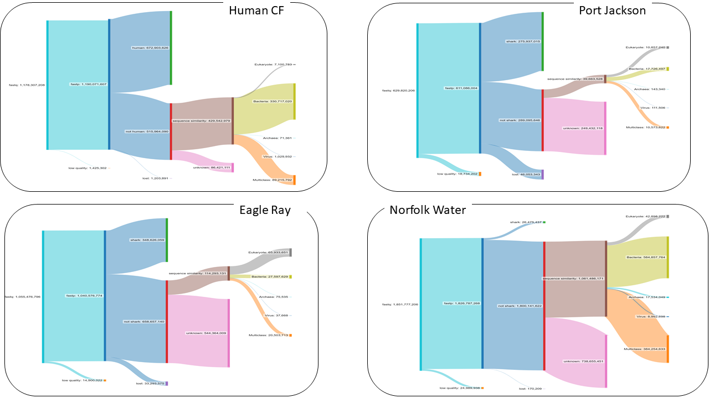

# Detailed processing steps for metagenome analysis

The atavide pipeline consists of multiple steps, that we run sequentially.

## DEFINTIONS.sh

We start with a `DEFINITIONS.sh` file that defines some variables that the scripts use. We source this
in the scripts and then use it to control the file names.

Note that none of the defintions should have spaces in them. If you get an unbound variable error when
running `atavide_lite`, make sure the defintions are correct!

The individual definitions are:

### SAMPLENAME

This should be any non-whitespace text. Please don't put spaces in the sample name. We use it to create
the output files, so that if you run `atavide_lite` on multiple different samples you can figure out
which sample is which!

This can be any useful mnemonic for your samples.

Examples:

```bash
export SAMPLENAME=AngelSharks
export SAMPLENAME=Sputum
export SAMPLENAME=PRJEB20836
```

### FILEEND

The `$FILEEND` variable is used to remove the `.fastq.gz` and other parts of the filename so that you end up with 
meaningful names. We only need to include the `R1` filename, as we will automatically do the same thing for `R2`
files. 

The first step will check and throw an error if you have forgotten to change this.

Examples:

```bash
export FILEEND=_S34_R1.fastq.gz
export FILEEND=_S34_L001_R1.fastq.gz
export FILEEND=_R1.fastq.gz
```

In each of these cases, we trim off all the `$FILEEND` text before making directories, output files, and so on.

### FAFILEEND

One of the necessary steps is to convert `fastq` to `fasta` so we can run `mmseqs2 easy-taxonomy`. We need
the same FAFILEEND so we know what to trim here. This will probably be the same as the `$FILEEND` variable
but with fastq substituted for fasta.

Examples:

```bash
export FAFILEEND=_S34_R1.fasta.gz
export FAFILEEND=_S34_L001_R1.fasta.gz
export FAFILEEND=_R1.fasta.gz
```

### SOURCE

This is the location of the `fastq` files to begin with. I almost always just use `fastq` since that makes sense!

Examples:

```bash
export SOURCE=fastq
```

### HOSTFILE

If you want to remove host DNA then specify the location of the fasta file that has the host genome. 
You can ommit this if you don't want to remove host DNA.

Examples:

```bash
export HOSTFILE=/scratch/$PAWSEY_PROJECT/$USER/Databases/human/GCA_000001405.15_GRCh38_no_alt_plus_hs38d1_analysis_set.fna.gz
```

### HOST and HOSTREMOVED

These two variables are the directories where you would like to save the host/no host data. It is just the names of the 
directories, so no spaces please, and it can be simple like the examples.

Examples:

```bash
export HOST=human
export HOSTREMOVED=no_human

export HOST=shark
export HOSTREMOVED=no_shark
```


# Processing steps

<a id="initialisation"></a>
### Initialisation

0. Set the source of the scripts

Clone the atavide lite repository to your home directory, and make the compiled code

```bash
git clone https://github.com/linsalrob/atavide_lite.git
cd atavide_lite/bin
make
SRC=~/atavide_lite/pawsey_slurm # change this to the most suitable source for you!
```

1. Set up the conda environment

Note, if you are working on Pawsey you should check out how to set up a temporary conda
installation.

```bash
mamba env create -f ~/atavide_lite/atavide_lite.yaml
mamba env create -f ~/atavide_lite/atavide_lite_vamb.yaml
```

2. Create some directories for the slurm output

```bash
mkdir -p slurm_output/host_slurm  slurm_output/megahit_slurm  slurm_output/mmseqs_slurm  slurm_output/vamb_slurm
```

3. Create a list of R1 files.

Several of the steps will use the file `R1_reads.txt` to know which reads we have. This is one of the main control files
as in our scripts we process through this file and compute the R1 and R2 data. 

_Note:_ for the single-read processing (e.g. MinION data) we call this file `reads.txt`!

```bash
find fastq -name \*_R1\* -printf "%f\n" > R1_reads.txt
NUM_R1_READS=$(wc -l R1_reads.txt | cut -f 1 -d ' ')
echo There are $NUM_R1_READS R1 readsA
if [[ $(find fastq -name \*_R2\* | awk 's++{} END {print s}') != $NUM_R1_READS ]]; then echo "There are a different number of R1 and R2 reads"; fi
```

<a id="read-based-analyses"></a>
### Read-based analyses

4. Quality control of the sequences

We use `fastp` to QC/QA the sequences and to trim any adapters and barcodes. You might want to look at the `fastp.slurm` file and check
the default parameters. Currently, we use `-n 1` which only allows one N in the sequence, and `-l 100` which sets the minimum length
of sequences to 100 bp. _Note:_ we have occassionally run into problems with data from the SRA which has reads of less than 100 bp
and so nothing passes QC/QA. Currently, we ignore that really old data, because we have not checked the subsequent steps to see if
the results are actually meaningful.

```bash
JOB=$(sbatch --parsable --array=1-$NUM_R1_READS:1 $SRC/fastp.slurm)
```

5. HOST REMOVAL (optional)

_Note:_ If you don't want to do host removal just set `HOSTREMOVED=fastq_fastp` in DEFINITIONS.sh

This optional step maps the reads to the host genome (e.g. human, shark, coral as specified by the `$HOSTFILE` varibale)
and removes those reads using `samtools`. We create new `R1` and `R2` files in the `$HOST` and `$HOSTREMOVED` directories
which contain the clean data.

Current processing does not do anything with the host reads, but you could use them for other purposes.

```bash
HOSTJOB=$(sbatch --parsable --array=1-$NUM_R1_READS:1 --dependency=afterok:$JOB $SRC/host_removal.slurm)
```

6. Convert to fasta for mmseqs

There is a common gotcha for `mmseqs2`, which is that the `easy-taxonomy` step requires the input to be in `fasta` format.
We have included a standalone C file that converts `fastq` to `fasta`, and we run that here. It processes
a whole directory at once.

```bash
FAJOB=$(sbatch --parsable --dependency=afterok:$HOSTJOB $SRC/fastq2fasta.slurm)
```

7. Run mmseqs taxonomy

This is the most computationally demanding step of the pipeline. On some clusters you might want to run this on the 
`long` queue or whatever the equivalent is.

We use the standard `mmseqs2 easy-taxonomy` pipeline. By default we use `UniRef50` as the database, but you can change 
that if you wish. (_Note:_ we're working on a comparison of what is missed between UniRef50 and UniRef100)

```bash
MMSEQSJOB=$(sbatch --parsable --dependency=afterok:$FAJOB $SRC/mmseqs_easy_taxonomy_submit.slurm)
```

8. Create a taxonomy table

Here we use `snakemake` to run the [summarise_taxonomy](summarise_taxonomy/README.md) pipeline to summarise the 
taxonomy outputs created by `mmseqs2 easy-taxonomy`. This first adds the taxonomy to the `.lca` files, and then
summarises those into a single `.tsv` file for each taxonomy level.

There was a design decision here to use the [pytaxonkit](https://github.com/bioforensics/pytaxonkit) wrapper to 
[taxonkit](https://github.com/shenwei356/taxonkit/) to add the taxonomy to the `.lca` files rather than using the 
`mmseqs2` taxonomy, because `taxonkit` provides a more complete taxonomy with fewer gaps. The cost is an 
additional compute step, but it doesn't take a massive amount of time because its just parsing text files.

```bash
sbatch --dependency=afterok:$MMSEQSJOB $SRC/mmseqs_summarise_taxonomy.slurm
```

9. Add the subsystems to the taxonomy

We _love_ the [BV-BRC](https://www.bv-brc.org/) subsystems (disclaimer: we wrote many of them!), and it is, to our 
knowledge, still the best functional hierarchy for metagenomics. 
We use an `sqlite` database to store the subsystems, and then we add those to the taxonomy. This also
provides us a per-taxonomy functional summary, which is useful for downstream analysis.

We then also count the subsystems and summarise them as raw or normalised counts.

```bash
SSJOB=$(sbatch --parsable --dependency=afterok:$MMSEQSJOB --array=1-$NUM_R1_READS:1 $SRC/mmseqs_add_subsystems_taxonomy_fast.slurm)
COUNTSSJOB=$(sbatch --parsable --dependency=afterok:$SSJOB $PAWSEY_SRC/count_subsystems.slurm)
```

<a id="assembly-based-analyses"></a>
### Assembly based analysis

10. Run megahit

We use megahit for the assembly, and we assemble each of the runs independently. This is because we have found that
trying to do cross-assemblies quickly runs out of memory!

```bash
MEGAHITJOB=$(sbatch  --parsable --dependency=afterok:$HOSTJOB --array=1-$NUM_R1_READS:1 $SRC/megahit.slurm
```
#### Binning with VAMB

We prefer VAMB for our binning, especially with the new version that allows you to split contigs.

11. Combine assemblies for VAMB

Note: this takes a few (<10) minutes, and so I run it on the short queue

```bash
VCJOB=$(sbatch --parsable --dependency=afterok:$MEGAHITJOB $SRC/vamb_concat.slurm)
```

12. Map vamb reads.

```bash
VMJOB=$(sbatch --parsable  --dependency=afterok:$VCJOB --array=1-$NUM_R1_READS:1 $SRC/vamb_minimap.slurm)
```


13. Run VAMB

```bash
sbatch --dependency=afterok:$VMJOB $SRC/vamb.slurm
```

14. Run checkm

```bash
# CHECKMJOB=$(sbatch --parsable --dependency=afterany:$VAMBJOB $SRC/checkm.slurm vamb/bins/ vamb/checkm)
CHECKMUNSPLITJOB=$(sbatch --parsable --dependency=afterany:$VAMBJOB $SRC/checkm.slurm vamb/clusters_unsplit vamb/checkm_unsplit)
CHECKMSPLITJOB=$(sbatch --parsable --dependency=afterany:$VAMBJOB $SRC/checkm.slurm vamb/clusters_split vamb/checkm_split)
```


# Grouped VAMB

There comes a time when we want to run vamb on a subset of reads, and so we have a `grouped` version of vamb.
We use a simple `.tsv` file to designate the groups, and then we run each of the components of vamb on that group.

For example, if we have a `.tsv` file with this data:

--- | ---
Host | Sample
Angelshark | GSV317\_
Angelshark | GSV326\_
Angelshark | GSV329\_
Angelshark | GSV342\_
Eagle\_Ray | ER128RecapASuck\_
Eagle\_Ray | ER151Suck\_
Eagle\_Ray | ER247Suck\_


We will separate GSV317, GSV326, GSV329, GSV342 into AngelShark and ER128RecapASuck, ER151Suck, ER247Suck into Eagle\_Ray directories, and then vamb them separately.

The main trick here is to make it so that the sample names only give 0 or 1 results when grepping through R1_reads.txt which is why I append the `_` to these names.

### Step 1: Create the contigs with the groups:

```bash
sbatch $SRC/vamb_concat_groups.slurm groups_sample.tsv
```

### Step 2: Map all the reads:

```bash
sbatch --array=1-$NUM_R1_READS:1 $SRC/vamb_minimap_group.slurm
```

### Step 3: Run vamb:

```bash
sbatch $SRC/vamb_group.slurm
```

All three lines as one go:

```bash
VCONCAT=$(sbatch --parsable $SRC/vamb_concat_groups.slurm groups_sample.tsv)
VMAP=$(sbatch --parsable  --dependency=afterok:$VCONCAT --array=1-$NUM_R1_READS:1 $SRC/vamb_minimap_group.slurm)
sbatch --parsable  --dependency=afterok:$VMAP $SRC/vamb_group.slurm
```

<a id="all-steps"></a>
# All commands in one go

We don't really recommend copying and pasting all the steps at once, although we usually do this anyway because
we are lazy. Depending on the [nuances of your system](#system-nuances) you will either end up
with a bunch of jobs that can't proceed because of unmet dependencies, or the jobs will be deleted 
from the queue if a prior dependency fails.

One of the big advantages of atavide_lite is that you can process a single file and replace that output
and then restart at any step without worrying about timestamps (like snakemake does!)

```bash
mkdir -p slurm_output/host_slurm  slurm_output/megahit_slurm  slurm_output/mmseqs_slurm  slurm_output/vamb_slurm slurm_output/fastp_slurm
find fastq -name \*_R1\* -printf "%f\n" > R1_reads.txt

export NUM_R1_READS=$(wc -l R1_reads.txt | cut -f 1 -d ' '); echo "There are $NUM_R1_READS reads"
SRC=~/atavide_lite/deepthought_slurm
cp $SRC/DEFINITIONS.sh .

# edit the DEFINITIONS file to change the sample name


JOB=$(sbatch --parsable --array=1-$NUM_R1_READS:1 $SRC/fastp.slurm)
HOSTJOB=$(sbatch --parsable --array=1-$NUM_R1_READS:1 --dependency=afterok:$JOB $SRC/host_removal.slurm)
FAJOB=$(sbatch --parsable --dependency=afterok:$HOSTJOB $SRC/fastq2fasta.slurm)
MMSEQSJOB=$(sbatch --parsable --array=1-$NUM_R1_READS:1 --dependency=afterok:$FAJOB $SRC/mmseqs_easy_taxonomy.slurm)
sbatch --dependency=afterok:$MMSEQSJOB $SRC/mmseqs_summarise_taxonomy.slurm
SSJOB=$(sbatch --parsable --dependency=afterok:$MMSEQSJOB --array=1-$NUM_R1_READS:1 $SRC/mmseqs_add_subsystems_taxonomy_fast.slurm)
sbatch --dependency=afterok:$SSJOB $SRC/count_subsystems.slurm
MEGAHITJOB=$(sbatch  --parsable --dependency=afterok:$HOSTJOB --array=1-$NUM_R1_READS:1 $SRC/megahit.slurm)
VCJOB=$(sbatch --parsable --dependency=afterok:$MEGAHITJOB $SRC/vamb_concat.slurm)
VMJOB=$(sbatch --parsable  --dependency=afterok:$VCJOB --array=1-$NUM_R1_READS:1 $SRC/vamb_minimap.slurm)
VAMBJOB=$(sbatch --parsable --dependency=afterany:$VMJOB $SRC/vamb.slurm)
VAMBUNSPLIT=$(sbatch --parsable --dependency=afterany:$VAMBJOB $SRC/vamb_split.slurm vamb/contigs.fna.gz vamb/vae_clusters_unsplit.tsv vamb/clusters_unsplit)
VAMBSPLIT=$(sbatch --parsable --dependency=afterany:$VAMBJOB $SRC/vamb_split.slurm vamb/contigs.fna.gz vamb/vae_clusters_split.tsv vamb/clusters_split)
# CHECKMJOB=$(sbatch --parsable --dependency=afterany:$VAMBJOB $SRC/checkm.slurm vamb/bins/ vamb/checkm)
CHECKMUNSPLITJOB=$(sbatch --parsable --dependency=afterany:$VAMBJOB $SRC/checkm.slurm vamb/clusters_unsplit vamb/checkm_unsplit)
CHECKMSPLITJOB=$(sbatch --parsable --dependency=afterany:$VAMBJOB $SRC/checkm.slurm vamb/clusters_split vamb/checkm_split)

```

<a id="optional-steps"></a>
# Optional steps

We have some optional steps that we run on some data, mainly when we run on data we download from the SRA.


## 16S detection

We have a 16S detection pipeline that uses the [16SMicrobial.fasta.gz](https://open.flinders.edu.au/ndownloader/files/55453691) from 
[partie](https://github.com/linsalrob/partie/) to determine whether a run from the SRA is a 16S sample
or a metagenome.

```bash
sbatch --parsable --export=ATAVIDE_CONDA=$ATAVIDE_CONDA  $PAWSEY_SRC/16S_detection_single.slurm
```

## Create a sankey plot

We love how Sankey plots summarise the data. Here are several metagenomes we've processed:



We can make the data using our sankey code once we have generated all the data.

```bash
SANKEYJOB=$(sbatch --parsable --dependency=afterok:$COUNTSSJOB $SRC/sankey_plot.slurm)
```
