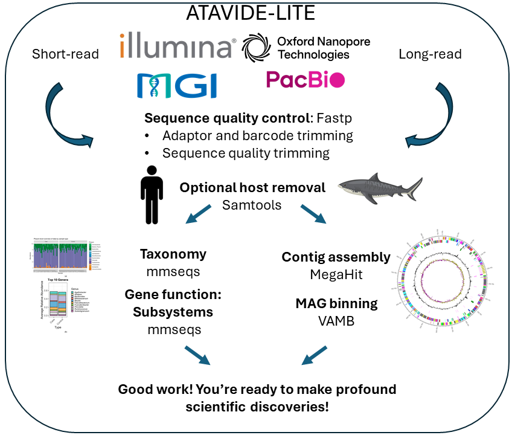

# Summary
`atavide lite` is a modular metagenomics processing pipeline designed to handle complex, 
multi-sample, multi-technology datasets. Instead of a single monolithic workflow, it
separates processing into discrete, independent steps, allowing users to run only what they need,
retry failed components without restarting the entire workflow, and optimise
resource use for their specific environment. The pipeline integrates both read-based 
and assembly-based approaches, and supports both paired-end short reads and long-read sequencing data.

# Statement of need

Numerous metagenomics pipelines exist, from web-based systems like MG-RAST `[@Meyer2008-mw:2008]`, to a proliferation of command-line pipelines 
`[e.g. @Clarke2019-go:2019; @Laudadio2019-og:2019; @Lu2022-yw:2022; @Garfias-Gallegos2022-cy:2022; @Walker2022-yo:2022; 
@Blanco-Miguez2023-ej:2023; @Tyagi2024-wl:2024; @Roach2024-qn:2024]`. Workflow management systems like Nextflow 
`[@Di_Tommaso2017-ir:2017]` and Snakemake `[@Koster2012-qn:2012]` streamlined the creation of pipelines
for bioinformatics analysis, including metagenomics. However, large-scale, real-world deployments reveal two persistent problems:

1. Fragility at scale When processing thousands of datasets, failures such as incomplete SRA downloads or database search timeouts can halt an entire run.

2. Poor portability across HPC environments: Optimising for one cluster often breaks performance or compatibility on 
another, especially when each platform has idiosyncratic storage, job scheduling, and runtime constraints.

For example, when processing thousands of samples from the Sequence Read Archive (SRA) 
`[@Leinonen2011-yd:2011]`, we found that some samples failed to download, and we had to 
interrupt the pipeline to fix the issue. Similarly, when using large computations, such as
comparing sequence reads to a database of reference sequences using MMSeqs `[@Steinegger2017-qw:2017]`, 
the computation occasionally times out because of limitations of the compute environment, 
or the computation fails for a variety of other reasons.

Our own experience highlighted these issues. Each of the computational platforms we use has nuances for the most
efficient computational processing. For example, our local HPC has a very fast local disk which
is available from a non-standard location and is only available to compute nodes. The Australian 
National Computational Infrastructure's Gadi system does not support large array jobs. The 
Pawsey Supercomputing Centre's Setonix system regularly deletes files on their "/scratch" 
disk, but has a large S3 storage system that is available to all compute nodes.

atavide_lite addresses these challenges by replacing an "all-or-nothing" execution model with 
independent, platform-optimised steps. We provide generic scripts that will run on most clusters, 
plus tuned configurations for the HPC systems we use, and encourage users to adapt them to their 
own environments. This design improves fault-tolerance, eases debugging, and enables efficient 
use of heterogeneous compute infrastructures.

# Overview of the pipeline

# Citations

Citations to entries in paper.bib should be in
[rMarkdown](http://rmarkdown.rstudio.com/authoring_bibliographies_and_citations.html)
format.

If you want to cite a software repository URL (e.g. something on GitHub without a preferred
citation) then you can do it with the example BibTeX entry below for @fidgit.

For a quick reference, the following citation commands can be used:
- `@author:2001`  ->  "Author et al. (2001)"
- `[@author:2001]` -> "(Author et al., 2001)"
- `[@author1:2001; @author2:2001]` -> "(Author1 et al., 2001; Author2 et al., 2002)"

# Figures

Figures can be included like this:

and referenced from text using \autoref{fig:example}.

Figure sizes can be customized by adding an optional second parameter:
{ width=20% }

# Acknowledgements

I acknowledge the support of  everyone

# References
