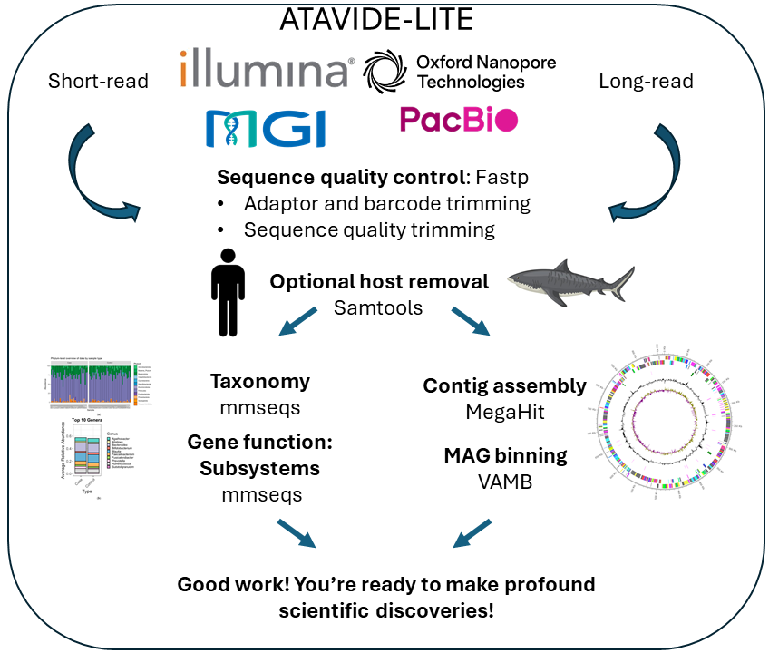

# Summary
`atavide lite` is a modular metagenomics processing pipeline designed to handle complex, 
multi-sample, multi-technology datasets. Instead of a single monolithic workflow, it
separates processing into discrete, independent steps, allowing users to run only what they need,
retry failed components without restarting the entire workflow, and optimise
resource use for their specific environment. The pipeline integrates both read-based 
and assembly-based approaches, and supports both paired-end short reads and long-read sequencing data.

# Statement of need

Numerous metagenomics pipelines exist, from web-based systems like MG-RAST `[@Meyer2008-mw:2008]`, to a proliferation of command-line pipelines 
`[e.g. @Clarke2019-go:2019; @Laudadio2019-og:2019; @Lu2022-yw:2022; @Garfias-Gallegos2022-cy:2022; @Walker2022-yo:2022; 
@Blanco-Miguez2023-ej:2023; @Tyagi2024-wl:2024; @Roach2024-qn:2024]`. Workflow management systems like Nextflow 
`[@Di_Tommaso2017-ir:2017]` and Snakemake `[@Koster2012-qn:2012]` streamlined the creation of pipelines
for bioinformatics analysis, including metagenomics. 

Most metagenomics pipelines work process sequence data in the same way. Each starts with quality control of the raw _fastq_ files retrieved from the DNA sequencing facility. Quality control includes removing low quality reads, removing adapters and linkers that remain in the sequences, and removing overly short or long reads. Next, if the sample is a host-associated sample, the pipelines remove reads that map to the host genome. At this point,  the pipelines often branch into read-based analysis and contig-based analysis. For read-based analysis, individual reads are annotated for taxonomy and function. The number of reads that map to each category is a proxy for the abundance of that category in the original sample, and so mapped reads are counted and their abundance normalised. For contig-based analysis, the contigs are grouped or binned into sets of contigs that likely came from the same organism, and then those contigs are annotated.

The continued decrease in the cost of DNA sequencing, together with the ever increasing sequencing throughput and computing power,
mean that these days we routinely generate metagenomics datasets with hundreds or thousands of samples, and each sample needs to be processed through this pipeline.

Managing this many samples across real-world, large-scale deployments reveal two persistent problems:

1. Fragility at scale When processing thousands of datasets, there are multiple failure points in each metagenomics analysis. 

2. Poor portability across HPC environments: Optimising for one cluster often breaks performance or compatibility on 
another, especially when each platform has idiosyncratic storage, job scheduling, and runtime constraints.

For example, when processing thousands of samples from the Sequence Read Archive (SRA) 
`[@Leinonen2011-yd:2011]`, we found that some samples failed to download, and we had to 
interrupt the pipeline to complete the downloads, fix the issue, and restart the pipeline. 
When processing our own data, corrupt or inconsistent sequence files (e.g. fastq files with different length sequences or quality scores),
can crash a run. Similarly, when using large computations, such as comparing sequence reads to a database of reference sequences using MMSeqs `[@Steinegger2017-qw:2017]`, 
the computation occasionally times out because of limitations of the compute environment, the compute fails because of unforeseen software incompatibility,
or the computation fails for a variety of other reasons. Although pipelines streamline and seemingly simplify the process, our experience showed that complex pipelines fail with different samples at different states, obfuscating the precise cause of the failure.

Moreover, each of the computational platforms we use has nuances for the most efficient computational processing. For example, our institutional HPC has a very fast local disk which is available from a non-standard location and is only available to compute nodes. The Australian National Computational Infrastructure's Gadi system does not support large array jobs. The Pawsey Supercomputing Centre's Setonix system regularly deletes files on their "/scratch" disk, but has a large S3 storage system that is available to all compute nodes but from a specific name.

`atavide_lite` addresses these challenges by replacing an "all-or-nothing" execution model of most computational pipelines with independent, platform-optimised steps. 
We provide generic scripts that will run on most clusters, plus tuned configurations for the HPC systems we use, and encourage users to adapt them to their 
own environments. We provide an issue form that allows users to request configurations for specific systems, and provide documentation to enable agentic-AI development of the pipelines tailored to any system.
This design improves fault-tolerance, eases debugging, and enables efficient 
use of heterogeneous compute infrastructures.

# Overview of the pipeline

## Design decisions

When designing `atavide_lite` we have attempted to make code that is re-usable on any system, and to simplify the processing steps. Specific design decisions we took include:

### User defined variables when possible.

We use a generic `DEFINITIONS.sh` file to define some common variables, and that should reside in each analysis directory and becomes part of the analysis. 

### Similar analysis for single-end and paired-end reads.

Although different instruments and technologies vary drastically, once the sequences themselves are generated, the analysis is usually quotidian. Wherever possible, we use the same analysis for all sequence read data.

### Using array jobs when possible.

Array scheduling on HPC systems allows users and administrators to issue a single command to control many tens or hundreds of jobs. Each cluster has different limits on how many jobs may be a part of an array, and this will be determined by your systems administrators, but generally more than 100 jobs are permissible in a single array.

### Leverage HPC scheduler controls when possible.

Most HPC systems have a controller that can start queued jobs based on dependencies. When possible, we queue all of the jobs at once, but allow the controller to start the dependencies if, and only if, the preceding job successfully completed. Depending on the specific HPC setup, dependent jobs may be marked as unable to complete or removed from the queue. If a job fails, the output and the logs will be clear where the failure point occurred so that the specific failure issue can be fixed before the computation is restarted.

## Computational steps in the pipeline.

Before the data is processed, there are a two steps that the user needs to perform. First, we create a `DEFINITIONS.sh` file in the working directory. This file defines a few variables that are used throughout the processing. First, we define the file ending for the fastq and fasta files. These endings are typically sequence instrument vendor specific (e.g. MGI-generated fastq files may have different file endings from Illumina-generated fastq files), and are trimmed from later files. We define a sample name which covers the whole dataset, and we define the location of the host genome sequence and where to save the host-related and not host-related sequences. Note the last three can be omitted if host mapping is not required.

Next, we create an `R1_reads.txt` or `reads.txt` file and either a `NUM_R1_READS` or `NUM_READS` variable. The `R1_reads.txt` file is required for processing paired end reads, while the single end reads uses `reads.txt`. The variables are really just a simple convenience and are not strictly necessary for processing the jobs, but make it easier to submit array jobs.

We start with quality control using _fastp_ `[@Chen2018-iw]` to remove any sequence with too many `N` bases, remove adapters, and reads that are too short. For ONT data, our defaults are two `N`'s and a minimum length of 50 bp, while for short-read data, our defaults are 1 `N` base and a minimum length of 100 bp.

The second step, if required, is to remove host DNA. `atavide_lite` maps the reads that pass quality control to the host genome using _minimap2_ `[@Li2018-qy]`, and then uses _samtools_ `[@Li2009-vs]` to filter the reads. Sequences that do not match the flag 3588 -- and thus represent mapped reads which pass the platform/vendor quality check, are not PCR or optical duplicates, and are primary alignments -- are filtered as mapping to the host genome. For short reads, additional samtools flags are used to identify R1 reads (matching flag 65) and R2 reads (matching flag 129). Reads that do not match the flag 3584 -- and thus represent unmapped reads which pass the platform/vendor quality check, are not PCR or optical duplicates, and are primary alignments -- are filtered as unmapped reads [PMID: 19505943], and again, short reads were separated using flags that match 77 for R1 reads and 141 for R2 reads. The matching and unmatching reads are stored separately, although currently we do not use the reads that match the host genome for any downstream analysis.

Note that the host genome can be any genome or multi-fasta record that the user wants excluded from subsequent analysis, and is defined in the aforementioned `DEFINITIONS.sh` file.

Reads that do not map to the host genome are converted to `fasta` format, and then mapped against the UniRef100 database `[@Suzek2007-py]` using the `easy-taxonomy` workflow built into MMseqs2. 

MMseqs2 easy-taxonomy parameters were optimised by the authors for a balance of sensitivity and speed and include a 7-mer double-match prefilter with compositional bias correction, low-complexity masking with TANTAN, and default similarity thresholds (--k-score ~95) that generate sufficient similar k-mers for accurate detection while maintaining computational efficiency. Candidate hits are further filtered by fast ungapped alignment and refined with vectorized Smith-Waterman alignments, after which taxonomic labels are assigned using a lowest common ancestor (LCA) approach described in more detail in their paper and on their websiteA `[@Steinegger2017-qw]`. The taxonomies are reformatted with taxonkit `[@Shen2021-pv]` and merged into a single table.

The functional annotations were enriched by mapping the UniProt IDs from the MMseq2 output directly to proteins associated with BV-BRC subsystems `[@Olson2023-fx]` (this was a 1:1 mapping and did not require thresholds/cutoffs). The number of reads that MMseqs2 reported mapped to each protein was counted, and the total was divided by the number of mapped reads to normalise the read counts.

For the assembly-based approaches, the metagenomes were assembled using megahit `[@Li2015-vg]` which by default employs a succinct _de Bruijn_ graph approach with multiple _k_-mer sizes (21 to 141 in steps of 20), automatic memory optimization, and conservative heuristics for contig pruning to balance assembly sensitivity, contiguity, and computational efficiency. Metagenome-assembled genomes (MAGs) were reconstructed using VAMB `[@Nissen2021-ry]`, a variational autoencoder-based approach that jointly encodes _k_-mer composition and differential coverage profiles of contigs into a low-dimensional latent space. By learning these compressed representations, VAMB effectively separates contigs originating from different microbial genomes and clusters them using a medoid-based algorithm. This deep learning approach has been shown to improve bin purity and completeness compared to conventional binning methods such as MetaBAT `[@Kang2019-zy] or CONCOCT `[@Alneberg2014-bk]`, particularly in complex metagenomic datasets `[@Papudeshi2017-xr]`

# Citations

Citations to entries in paper.bib should be in
[rMarkdown](http://rmarkdown.rstudio.com/authoring_bibliographies_and_citations.html)
format.

If you want to cite a software repository URL (e.g. something on GitHub without a preferred
citation) then you can do it with the example BibTeX entry below for @fidgit.

For a quick reference, the following citation commands can be used:
- `@author:2001`  ->  "Author et al. (2001)"
- `[@author:2001]` -> "(Author et al., 2001)"
- `[@author1:2001; @author2:2001]` -> "(Author1 et al., 2001; Author2 et al., 2002)"

# Figures

Figures can be included like this:

and referenced from text using \autoref{fig:example}.

Figure sizes can be customized by adding an optional second parameter:
{ width=20% }

# Acknowledgements

I acknowledge the support of  everyone

# References
